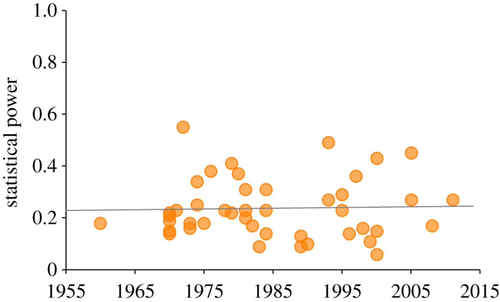

## Heritability of Bad Science?

* [**The natural selection of bad science**](http://rsos.royalsocietypublishing.org/content/3/9/160384)
    * Smaldino & McElreath, RSOS, 21 September 2016 DOI: 10.1098/rsos.160384
* [**The Inevitable Evolution of Bad Science**](http://www.theatlantic.com/science/archive/2016/09/the-inevitable-evolution-of-bad-science/500609/)
    * Yong, The Atlantic, 21 September 2016

## TL;DR

Incentives that prioritize **lots** of publications will lead to using 
methods that generate **high** false positives. These methods will be inherited 
and propagated across labs over time.

## Bad Science

* High false-positive rates 
* That can't be replicated


------

> This paper argues that some of the most powerful incentives in contemporary science actively encourage, reward and propagate poor research methods and abuse of statistical procedures.

> ... requires no conscious strategizing nor cheating on the part of researchers. Instead, it arises from the positive selection of methods and habits that lead to publication

<div id = "citation">PE Smaldino & R McElreath, RSOS 2016</div>

## Statistical Power

> The power or sensitivity of a binary hypothesis test is the probability that the test correctly rejects the null hypothesis (H0) when the alternative hypothesis (H1) is true. It can be equivalently thought of as the probability of accepting the alternative hypothesis (H1) when it is true—that is, the ability of a test to detect an effect, if the effect actually exists.

<div id = "citation">https://en.wikipedia.org/wiki/Statistical_power</div>

```{r setup, echo=FALSE, include = FALSE, message = FALSE, warning = FALSE}
library(ggplot2)
library(cowplot)
library(dplyr)
library(broom)
library(fakeDataWithError)
library(pwr)
set.seed(4567)

knitr::opts_chunk$set(cache = TRUE, echo = FALSE, message = FALSE, warning = FALSE)

# function definitions
run_ttest <- function(grp_frame){
  g1_sample <- filter(grp_frame, grp == 1) %>% select(data) %>% unlist()
  g2_sample <- filter(grp_frame, grp == 2) %>% select(data) %>% unlist()
  
  t_res <- tidy(t.test(g1_sample, g2_sample, var.equal = TRUE))
  t_res
}

data_w_offset <- function(grp_1, grp_2, offset = 0, noise_level = 0.05){
  g1_noise <- add_uniform_noise(1, grp_1, noise_level)
  g2_noise <- add_uniform_noise(1, grp_2 + offset, noise_level)
  
  data.frame(data = c(g1_noise, g2_noise),
                      grp = (rep(c(1, 2), each = 100)),
                      sample = FALSE,
                      id = seq(1, 200))
}

jitter_data <- function(grp_frame){
  grp_frame$x <- jitter(grp_frame$grp)
  grp_frame
}
```


## Example

```{r power_example1, include=FALSE}
start_data <- rnorm(200, 0, 0.3)

grp_1_index <- sample(200, 100)
grp_1 <- start_data[grp_1_index]
grp_2 <- start_data[-grp_1_index]

grp_1 <- grp_1 - mean(grp_1)
grp_2 <- grp_2 - mean(grp_2)

grp_diff_05 <- data_w_offset(grp_1, grp_2, offset = 0.5)
```

```{r sample_power, fig.show = "animate"}
diff_05_jitter <- jitter_data(grp_diff_05) %>% group_by(grp)

jitter_plot <- ggplot(diff_05_jitter, aes(x = x, y = data)) + geom_point(size = 3) + theme(legend.position = "none")


grp_05 <- group_by(diff_05_jitter, grp)
x_range <- c(0, 50)
y_range <- c(0, 2.6)

cut_value <- -1 * log10(0.05)
cut_data <- data.frame(try = c(0, 50),
                       p.value = c(cut_value, cut_value))

cut_plot <- ggplot(cut_data, aes(x = try, y = p.value)) + geom_line(color = "red") + coord_cartesian(xlim = x_range, ylim = y_range) + ylab("-log10(p.value)")
sig_data <- data.frame(try = seq(1, 50),
                       p.value = NA)
init_plot <- plot_grid(jitter_plot, cut_plot, nrow = 1)


print(init_plot)
for (isim in 1:50) {
  diff_05_jitter$sample <- FALSE
  diff_sample <- sample_n(diff_05_jitter, 3)
  j_plot <- jitter_plot + geom_point(data = diff_sample, aes(x = x, y = data), size = 3, color = "red")
  sig_data[isim, "p.value"] <- -1 * log10(run_ttest(ungroup(diff_sample))$p.value)
  c_plot <- cut_plot + geom_point(data = sig_data, size = 3) + coord_cartesian(xlim = x_range, ylim = y_range) + ylab("-log10(p.value)")
  
  curr_plot <- plot_grid(j_plot, c_plot, nrow = 1)
  print(curr_plot)
}
```

## Example

```{r final_plot_sp}
print(curr_plot)
```

## Power as Function of Sample Size

```{r power_by_sample}
diff_value <- 0.5 / sd(grp_1)
power_values <- pwr.t.test(seq(3, 20), d = diff_value, sig.level = 0.05, type = "two.sample") %>%
  tidy()

ggplot(power_values, aes(x = n, y = power)) + geom_line() + ggtitle("P = 0.05, D = 1.7")
```

## Unpublished Results (False Negatives)

```{r unpublished_results, fig.height=5}
published_data <- filter(sig_data, p.value >= (-1 * log10(0.05)))

pub_plot <- cut_plot + geom_point(data = sig_data, size = 3) + geom_point(data = published_data, size = 3, color = "green") + coord_cartesian(xlim = x_range, ylim = y_range) + ylab("-log10(p.value)")
plot_grid(jitter_plot, pub_plot, nrow = 1)
```


## What About False Positives?

```{r sample_power_fp, fig.show = "animate"}
grp_diff_0 <- data_w_offset(grp_1, grp_2, 0.01)
diff_0_jitter <- jitter_data(grp_diff_0) %>% group_by(grp)

jitter_plot <- ggplot(diff_0_jitter, aes(x = x, y = data)) + geom_point(size = 3) + theme(legend.position = "none")


grp_0 <- group_by(diff_0_jitter, grp)
x_range <- c(0, 50)
y_range <- c(0, 2.6)

cut_value <- -1 * log10(0.05)
cut_data <- data.frame(try = c(0, 50),
                       p.value = c(cut_value, cut_value))

cut_plot <- ggplot(cut_data, aes(x = try, y = p.value)) + geom_line(color = "red") + coord_cartesian(xlim = x_range, ylim = y_range) + ylab("-log10(p.value)")
sig_data <- data.frame(try = seq(1, 50),
                       p.value = NA)
init_plot <- plot_grid(jitter_plot, cut_plot, nrow = 1)


print(init_plot)
for (isim in 1:50) {
  diff_0_jitter$sample <- FALSE
  diff_sample <- sample_n(diff_0_jitter, 3)
  j_plot <- jitter_plot + geom_point(data = diff_sample, aes(x = x, y = data), size = 3, color = "red")
  sig_data[isim, "p.value"] <- -1 * log10(run_ttest(ungroup(diff_sample))$p.value)
  c_plot <- cut_plot + geom_point(data = sig_data, size = 3) + coord_cartesian(xlim = x_range, ylim = y_range) + ylab("-log10(p.value)")
  
  curr_plot <- plot_grid(j_plot, c_plot, nrow = 1)
  print(curr_plot)
}
```

## What About False Positives?

```{r final_plot_fp}
print(curr_plot)
```


## Not Whole Story

> * Selection bias
> * Post-hoc analyses
>     * "That looks interesting! Run another t-test!"
>     * Even though was not part of experimental design
>     * Also known as P-hacking
> * **Bad experimental design**
>     * Confounding factors
> * Multiple testing
> * Developing more and more sensitive methods

--------

> * Posit that these kinds of behaviors are **inherited and propagated** over time!
> * Why? Because they get publications!
> * Without malicious intent

## StatCheck

> We found that half of all published psychology papers ... contained at least one p-value that was inconsistent with its test,

<div id = "citation">MB Nuijten et al., Behav Res, 2015</div>

> Most striking was that the errors weren’t entirely random. Most of the errors tipped the results in favor of statistical significance. And around 13 percent of the papers contained an error that could potentially change the paper’s conclusions.

<div id = "citation">B Resnick, Vox, 2016</div>

## Malicious Intent?

<figure>

<figcaption>Samie et al., Scientific Reports 2016</br>
Front. Pharmacol 2016</br>
PeerJ 2016</figcaption>
</figure>

## Paper

> * *Why do false positive results litter the publication record?*
> * Statistical power over time
> * Evolutionary model of labs, fitness defined by number of publications
> * Trying to **model** possible **causes** and effect of 1 **intervention** 

## Caveats

* Examined Social Studies and Psychology
* But I believe results apply to Biological Sciences

## Has Statistical Power of Studies Improved Over Time?

<figure>
  
  <figcaption>Figure 1. Average statistical power from 44 reviews of papers published in journals in the social and behavioural sciences between 1960 and 2011. Data are power to detect small effect sizes (d=0.2), assuming a false-positive rate of α=0.05, and indicate both very low power (mean=0.24) but also no increase over time (R2=0.00097).</figcaption>
</figure>

## Model

<div id = "left">
* Computable model of labs + publications
* **Power**: think it corresponds to **sensitivity** (true positive rate)
    * Increasing sensitivity == decreasing specificity
* Expending **effort** reduces false positives
</div>
<div id = "right">

</div>

## Model: Labs

<div id = "left" style = "font-size: 75%;">
* Lab has a characteristic **power** (sensitivity or TPR)
    * Combination of entire chain of inference
* Increasing **power** also increases labs **FPR**, unless **effort** is exerted
* Increasing effort decreases the productivity of a lab, because it takes longer to perform rigorous research
* Effort and power are independent parameters
* Power, effort, FPR interrelated throughout the simulation
* **Fitness determined by Num. publications**
</div>

<div id = "right">
<figure>
<figcaption>Figure 2. The relationship between power and false-positive rate, modified by effort, e. Runs analysed in this paper were initialized with e0=75 (shown in orange), such that α=0.05 when power is 0.8.</figcaption></figure>
</div>

## Model: Experiments

* Three phases: 
    * hypothesis selection
    * investigation 
    * communication
* Novel hypothesis or replication
* When true hypotheses are rarer, false positives will occur more frequently
* Increases in effort do not also increase power (sensitivity), but reduce FPR
* Makes sense when power is dependent on the type of experiment or analytical method

## Model: Publication

* **Positive** novel results are **always** publishable
* **Negative** novel results **never** are
* Positive and negative replications are published with probabilities cR+ and cR−, respectively
* Increased publications increases lab fitness
* Different for novel *vs* replicated
    
## Model: Selection & Replication

* Oldest lab dies
* From random sample of labs, most fit lab replicates
    * Number of publications is measure of fitness
* Favor those strategies that increase fitness (publications) most quickly
* New lab inherits most successful lab, with mutation

## Running Simulation

* 1 million time steps
* Every 2000 steps, sample values of power, effort, etc + false discover rate

## Parameters


## Novel Studies Only

<figure>

<figcaption>Figure 3. Power evolves. The evolution of mean power (W), false-positive rate (α) and false discovery rate (FDR).</figcaption>
</figure>

## Simulate Constant Power & Evolving Effort

<figure>

<figcaption>Figure 4. Effort evolves. The evolution of low mean effort corresponds to evolution of high false-positive and false discovery rates. Here selection favoured labs who put in less effort towards ensuring quality work, which increased publication rates at the cost of more false discoveries.</figcaption>
</figure>

## Fix via Replication??

* Initialize so that 1% of all investigations are replications
* Allow replication rate to evolve
* All replications are publishable, 1/2 value of novel study
* Successful replication increases other labs novel finding by 10%
* Failure to replicate penalizes original finding by 100

## Fix via Replication??

<figure>

<figcaption>Figure 5. The coevolution of effort and replication.</figcaption>
</figure>

## Fix via Replication??

* Fix replication rate at **high** values
* Test
    * 0%
    * 25%
    * 50%
* Examine evolution of effort

## Fix via Replication??

<figure>

<figcaption>Figure 6. The evolution of effort when zero, 25% or 50% of all studies performed are replications.
</figcaption>
</figure>

## Why??

* Top performing labs will always cut corners, won't always be caught
* Can only fix by **replicating every study**

## High vs Low Effort

* Fixed power (0.8)
* Make labs **high** or **low** effort
    * Split 50%
* 10 time steps with no replication to get a body of literature
* 100 time steps replicating with particular rate
    * three rates, 0%, 1%, 5%

## High vs Low Effort

<figure>

<figcaption>Figure 7. Lab pay-offs from the non-evolutionary model. Each graph shows count distributions for high and low effort labs’ total pay-offs after 110 time steps, 100 of which included replication. (a–c) Total count for each pay-off is totalled from 50 runs for each condition. Panel (c) includes an inset that displays the same data as the larger graph, but for a narrower range of pay-offs. The punishment for having one’s novel result fail to replicate is orders of magnitude greater than the benefit of publishing, reflected in the discrete peaks in (b) and (c).
</figcaption>
</figure>

## Conclusions

* Using num. of publications to judge researchers *may* be *partly* responsible for current glut
of high false-positive results
* *Replication alone* will not solve the current problem of high false-positives
* Need to change the currency of academia
